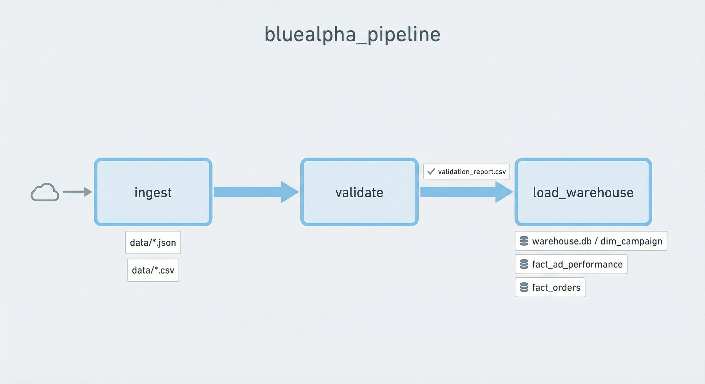

# Data Pipeline Challenge

## Setup instructions

1. **Clone the repo** and go to the project root (where `requirements.txt` and `data/` are).
2. **Create and activate a virtual environment:**
   ```bash
   python -m venv .venv
   source .venv/bin/activate   # Windows: .venv\Scripts\activate
   ```
3. **Install dependencies:**
   ```bash
   pip install -r requirements.txt
   ```
4. **Run the pipeline** with Airflow (see [How to run your pipeline](#how-to-run-your-pipeline) below).

No Docker required by default; the warehouse is SQLite at `output/warehouse.db`.

## Dependencies and requirements

- **requirements.txt** (required for the pipeline; also used by Airflow tasks):
  - `pandas` – data frames and CSV/parsing
  - `python-dateutil` – date parsing
  - `sqlalchemy` – warehouse schema and load (SQLite or Postgres)
  - `psycopg2-binary` – only if you set `WAREHOUSE_URL` to Postgres
- **requirements-airflow.txt** – required to run the pipeline: install in a venv (`pip install -r requirements-airflow.txt`); it includes `requirements.txt` and `apache-airflow`.

Python 3.10+ recommended. Input data must be in the `data/` folder (`google_ads_api.json`, `facebook_export.csv`, `crm_revenue.csv`).

## How to run your pipeline

The pipeline runs **with Apache Airflow** (ingest → validate → load_warehouse). See [Run the pipeline (Apache Airflow)](#run-the-pipeline-apache-airflow) below.

| Goal | How |
|------|-----|
| **Full pipeline** | Start Airflow, trigger DAG `bluealpha_pipeline` |
| Ingest + validate only (no DB) | `python run_ingestion.py` (optional) |

Outputs: `output/validation_report.csv` and `output/warehouse.db`. To inspect them, open **output.ipynb** or query the SQLite DB directly.

Design rationale, data quality strategy, and architecture decisions are in **[DESIGN.md](DESIGN.md)**.

---

## Overview (challenge brief)

Build a data pipeline that ingests advertising data from multiple "platforms," handles data quality issues, transforms the data into an analytics-ready warehouse schema, and includes orchestration.


**Expected time:** 4 hours.

**When to Ask vs. When to Assume:**

We're evaluating **both** your judgment about when to ask vs. when to assume **and** the quality of your assumptions. Technical implementation details can often be assumed. Business-critical decisions about data relationships and intended use cases may warrant clarification.

## Background

At BlueAlpha, we help marketers understand which channels drive results and how to allocate budgets. To do this, we need to:
1. Ingest data from many different sources (ad platforms, CRMs, spreadsheets)
2. Handle the inevitable data quality issues (missing values, duplicates, format inconsistencies)
3. Transform everything into a unified schema for analysis

This challenge mirrors that work at a smaller scale.

## Deliverables

### 1. Data Ingestion Layer (Python)

Ingest data from the 3 mock sources provided in the `data/` directory:

| File | Description |
|------|-------------|
| `google_ads_api.json` | Simulated API response |
| `facebook_export.csv` | CSV export file |
| `crm_revenue.csv` | CRM export |

### 2. Data Quality & Validation

- Implement validation checks for each source
- Handle: missing values, duplicates, format inconsistencies, invalid data

### 3. Transformation Layer (SQL/dbt-style)

Design a normalized warehouse schema and write transformations. You can use dbt, SQLAlchemy, raw SQL, or Python—whatever you're most comfortable with.

### 4. Orchestration

Define a DAG/workflow that:
- Handles dependencies between ingestion, validation, and transformation
- Includes retry logic for failures
- Is idempotent (safe to re-run)

**Note:** Working code is preferred, but well-documented pseudo-code/config is acceptable if local orchestrator setup is complex.

### 5. Documentation

Include in your submission:

**README.md** with:
- Setup instructions (how to run your pipeline)
- Dependencies and requirements

**DESIGN.md** (~1-2 pages) covering:
- Schema design decisions and rationale
- Data quality strategy
- Trade-offs made given time constraints
- What you'd do differently with more time
- **Architecture Decision** for major decisions:
  - For key decisions, document: the options considered, your chosen approach, why you chose it, and what trade-offs you accepted
  - Examples: CRM data handling, outlier treatment, orchestration tool choice


## Submission

Submit your solution as a GitHub repository (public or private with access granted). Include:
- All source code
- README with setup instructions
- DESIGN.md with your design document (including ADRs)
- Any additional documentation you think is helpful

## After Submission

We'll schedule a 30-45 minute live walkthrough where you'll:
1. Walk us through your design decisions
2. Explain how you handled specific data quality issues
3. Discuss what you'd change with more time
4. Answer questions about scaling and edge cases

This is a conversation, not a test. We're interested in your thinking process and how you approach problems.

---

## Project structure

| Folder / file | Description |
|---------------|-------------|
| **ingestion/** | Loads raw data into DataFrames. See [Ingestion](#ingestion) below. |
| **validation/** | Data-quality checks and validation report; no rows dropped. See [Validation](#validation) below. |
| **transformation/** | Warehouse schema and load. See [Transformation](#transformation) below. |
| **orchestration/** | Airflow DAG (ingest → validate → load_warehouse) with retries. See [Orchestration](#orchestration) below. |
| **orchestration/airflow_dag.py** | Airflow DAG definition (`bluealpha_pipeline`). |
| **data/** | Input data (google_ads_api.json, facebook_export.csv, crm_revenue.csv). |
| **eda.ipynb** | Exploratory data analysis and column-level checks on the raw sources. |
| **run_ingestion.py** | Optional: ingest + validate only (no database). |

### Ingestion

Loads raw data from the three sources into pandas DataFrames.

- **Inputs:** `data/google_ads_api.json`, `data/facebook_export.csv`, `data/crm_revenue.csv`
- **Outputs:** Three DataFrames (Google Ads, Facebook, CRM)

**Behaviour:** Google Ads — reads JSON, flattens to one row per campaign per date. Facebook — reads CSV (campaign_id, date, spend, purchases, etc.). CRM — reads CSV line-by-line so rows with commas in date fields (e.g. `"January 4, 2024"`) are preserved; merges date columns so revenue and attribution stay aligned.

**Public API:** `load_google_ads()`, `load_facebook()`, `load_crm()` — see `ingestion/loaders.py`.

### Validation

Runs data-quality checks and records issues without dropping rows. All rows stay in the pipeline; problems are written to a report.

- **Inputs:** The three DataFrames from ingestion (Google, Facebook, CRM).
- **Outputs:** The same three DataFrames (with normalizations applied) plus `output/validation_report.csv`.

**Checks:** nulls, duplicates, date formats (normalized to ISO where possible), negative revenue, outliers (e.g. revenue > 10× p99 or > 1e6), channel casing, empty campaign_source. Unparseable dates are kept and flagged in the report.

**Normalizations:** Google `cost_micros` → `spend` (dollars); Facebook/CRM dates normalized where parseable; CRM `channel_attributed_normalized` (lowercase) for consistency.

**Public API:** `ValidationReport`, `validate_google_ads()`, `validate_facebook()`, `validate_crm()` — see `validation/validators.py` and `validation/report.py`.

### Transformation

Builds the analytics warehouse from validated DataFrames: schema creation and loading into dim/fact tables.

- **Inputs:** The three validated DataFrames (Google, Facebook, CRM).
- **Outputs:** Warehouse DB (SQLite at `output/warehouse.db` by default, or Postgres when `WAREHOUSE_URL` is set).

**Tables:** **dim_campaign** — one row per campaign per platform (from Google + Facebook). **fact_ad_performance** — daily ad metrics (impressions, clicks, spend, conversions, etc.) from Google and Facebook. **fact_orders** — order-level revenue with attribution fields (`channel_attributed`, `campaign_source`, etc.); duplicate `order_id`s deduplicated at load (keep first).

**Behaviour:** Full refresh each run (drop and recreate tables, then insert). Schema supports both SQLite and Postgres (e.g. AUTOINCREMENT vs SERIAL).

**Public API:** `get_engine()`, `create_warehouse_schema()`, `load_from_validated()` — see `transformation/schema.py` and `transformation/load.py`.

### Orchestration

The pipeline runs as an **Airflow DAG**: **ingest → validate → load_warehouse**, with retries and idempotent behaviour. The DAG is defined in `orchestration/airflow_dag.py`; tasks pass data via staged files under `output/airflow_staging/<run_id>/`. Re-running is safe: validation report and warehouse are fully overwritten each run.

---

## Note on orchestration & Docker

The pipeline is designed to run **without Docker** by default (warehouse = SQLite at `output/warehouse.db`). I wanted to demonstrate pipeline orchestration—the DAG, dependencies, retries, and idempotency—without tying the take-home to Docker setup or troubleshooting. The same code path supports Postgres when `WAREHOUSE_URL` is set (e.g. in a deployed environment where Postgres is already available). So: run locally with SQLite to see the full pipeline; use Postgres when it fits your stack.

---

## Ingestion pipeline (this repo)

If you haven’t already, follow [Setup instructions](#setup-instructions) above. For **eda.ipynb** and **output.ipynb**, use the same venv and open in Jupyter or VS Code.

### Run the pipeline (Apache Airflow)

The pipeline runs as an Airflow DAG: **ingest → validate → load_warehouse**. Data is passed between tasks via staged pickle files under `output/airflow_staging/<run_id>/`.



| Task            | Inputs                    | Outputs                                                                 |
|-----------------|---------------------------|-------------------------------------------------------------------------|
| **ingest**      | `data/*.json`, `data/*.csv` | 3 DataFrames (Google, Facebook, CRM)                                   |
| **validate**    | 3 DataFrames              | Same 3 DataFrames (normalized) + `output/validation_report.csv`        |
| **load_warehouse** | 3 DataFrames           | `output/warehouse.db` (SQLite) or Postgres: dim_campaign, fact_ad_performance, fact_orders |

1. **Install Airflow** (use a dedicated venv):
   ```bash
   python -m venv .venv-airflow && source .venv-airflow/bin/activate
   pip install -r requirements-airflow.txt
   ```

2. **Point Airflow at this repo:** set `AIRFLOW__CORE__DAGS_FOLDER` to the repo’s **orchestration/** directory (e.g. `/path/to/data-engineer-coding-task/orchestration`). Set `AIRFLOW__CORE__LOAD_EXAMPLES=False` to avoid loading example DAGs. Airflow loads `airflow_dag.py` from that folder. The DAG file adds the project root to `sys.path`, so `ingestion`, `validation`, and `transformation` are importable when tasks run.

3. **Start Airflow** (e.g. `airflow standalone`), then trigger the DAG **bluealpha_pipeline** from the UI (http://localhost:8080) or CLI: `airflow dags trigger bluealpha_pipeline`.

**Defaults:** Writes to **SQLite** at `output/warehouse.db`. Set `WAREHOUSE_URL` in the Airflow environment to use Postgres. Duplicate `order_id`s are deduplicated at load (keep first); duplicates are still in the validation report.

**Optional – ingest + validate only (no DB):** `python run_ingestion.py` loads and validates, writes `output/validation_report.csv`, no warehouse.
